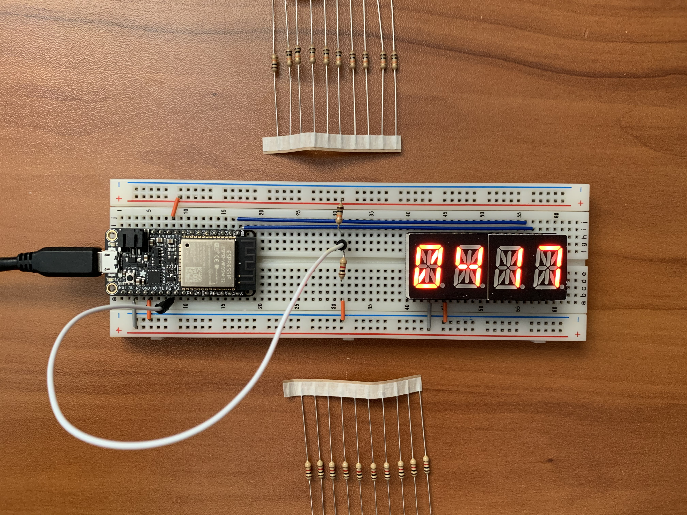

#  Battery Voltage Monitor

Author: Anthony Faller

Date: 2020-09-24
-----

## Summary
Using the example adc code provided on espressif GitHub, I created a program which reads an input voltage and displays it to the alphanumeric display. I used a voltage divider with R1=10k and R2=1k, which gives a voltage division of about 1/11.

## Sketches and Photos

  

## Modules, Tools, Source Used Including Attribution
[ESP-IDF Example Code](https://github.com/espressif/esp-idf/tree/39f090a4f1dee4e325f8109d880bf3627034d839/examples/peripherals/adc)

## Supporting Artifacts

-----
