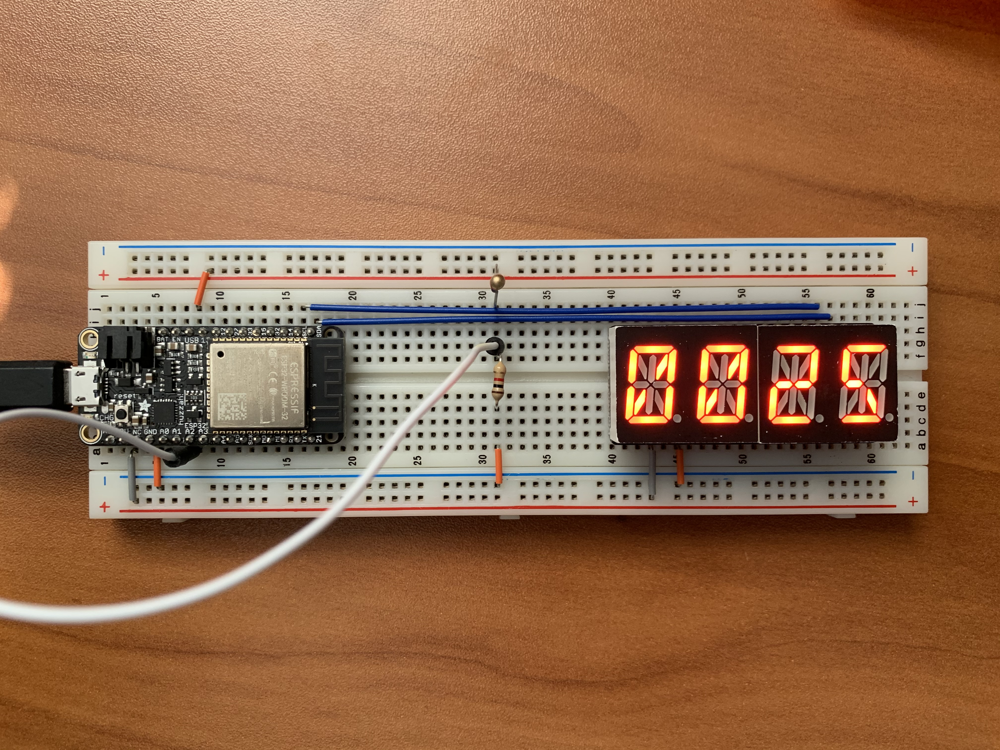
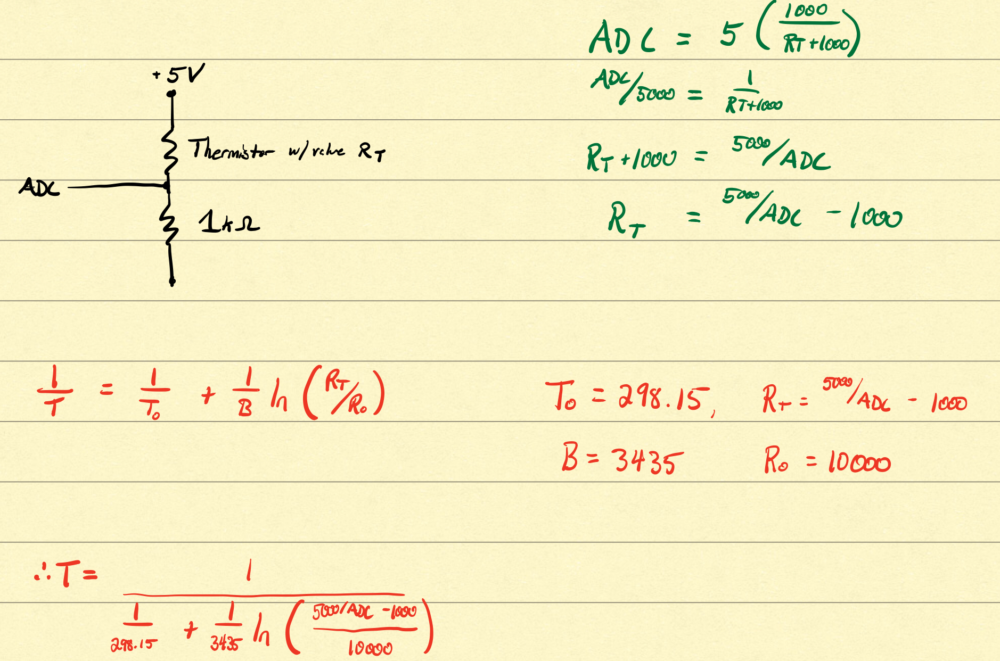

#  The Thermistor

Author: Anthony Faller

Date: 2020-09-25
-----

## Summary
This is almost the exact same as skill 12, except R1 in the voltage divder has been replaced with the given thermistor. The ADC input is now sampled once every two seconds, and temperature is displayed to both console and the i2c display.

## Sketches and Photos

  

## Modules, Tools, Source Used Including Attribution
[Equation for Calculating Thermistor Temperature](https://en.wikipedia.org/wiki/Thermistor)

## Supporting Artifacts
Calculations

 

-----
