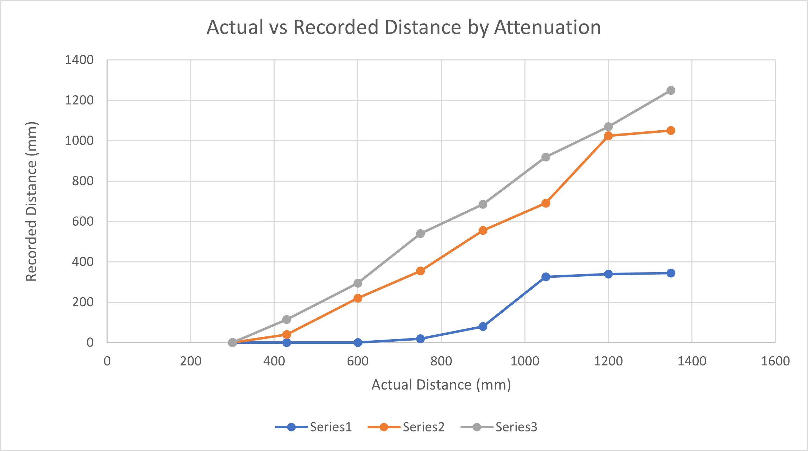

#  Ultrasonic Range Sensor

Author: Anthony Faller

Date: 2020-29-09
-----

## Summary
Using ADC, I have created a program which reads a value from the ultrasonic sensor and converts it to a distance in mm. Per the linked data sheet, a ten-bit ADC input can simply be multiplied by five to obtain the distance in mm.

At first, the sensor was producing wildly inaccurate readings: an object placed anywhere within a meter would cause a zero-distance reading, and the maximum output was only about 330mm. 

I played around with the attenuation and took some calibration points, which can be seen in the graph below. I discovered that a zero-attenuation factor was the most accurate out of the options, but was still off by about 300mm. I calibrated this by simply adding 300 to the range output, but this reduces the minimum acceptable range to about one foot away from the sensor. 

My suspicion is that there may be a defect in the hardware, particularly because when I plugged the ADC probe to Vcc and ground, it read the appropiate max and min outputs of 5m and 0m respectively. 

## Sketches and Photos

 

## Modules, Tools, Source Used Including Attribution
[Example ADC Code](https://github.com/espressif/esp-idf/tree/39f090a4f1dee4e325f8109d880bf3627034d839/examples/peripherals/adc)

## Supporting Artifacts
[Spreadsheet of Distances](https://drive.google.com/file/d/1gUJE9gHU_l2HG3DQjzVpU7fd9E7jC8r3/view?usp=sharing)

-----
