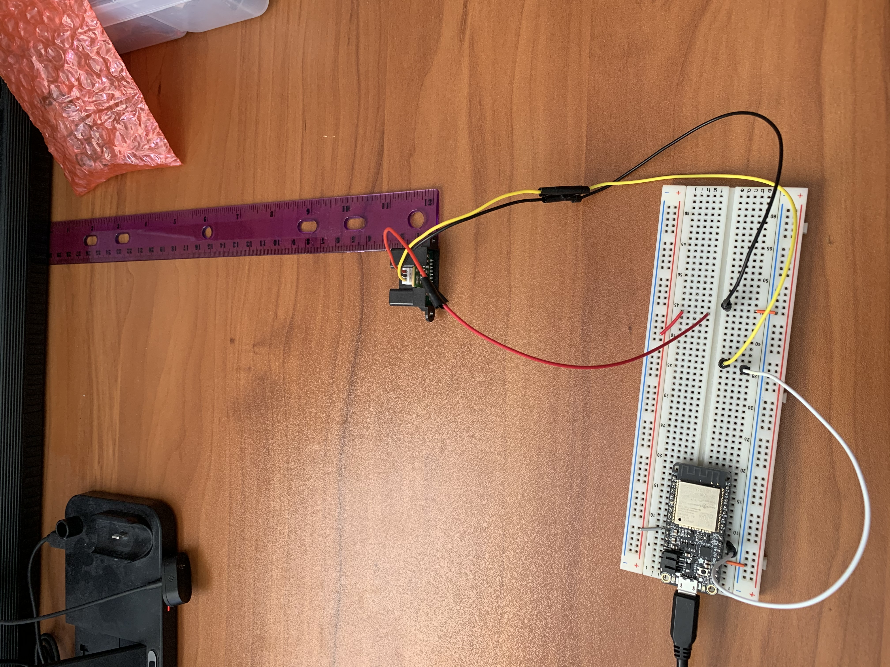

#  Long Range IR Range Sensor

Author: Anthony Faller

Date: 2020-30-09
-----

## Summary
I've created a module that utilizes the IR range sensor. My program gives an accurate distance reading of 30cm - 150cm with an error margin of +/- 10cm. 

Using the graph on the sensor spec sheet, I was able to find a trendline to interpolate voltage/distance relationships within range. I was able to verify my readings using a ruler and a tape measure.

## Sketches and Photos

 

## Modules, Tools, Source Used Including Attribution
[Sensor Spec Sheet](https://www.sparkfun.com/datasheets/Sensors/Infrared/gp2y0a02yk_e.pdf)

[Example ADC Code](https://github.com/espressif/esp-idf/tree/39f090a4f1dee4e325f8109d880bf3627034d839/examples/peripherals/adc)

[Float Division (I forgot how this works & had to look it up)](https://stackoverflow.com/questions/16221776/why-dividing-two-integers-doesnt-get-a-float)

## Supporting Artifacts
[Graph with Trendline](https://drive.google.com/file/d/10zRzCgEcSNi9R7xVlXQkZN_kbUITYtA3/view?usp=sharing)

-----
