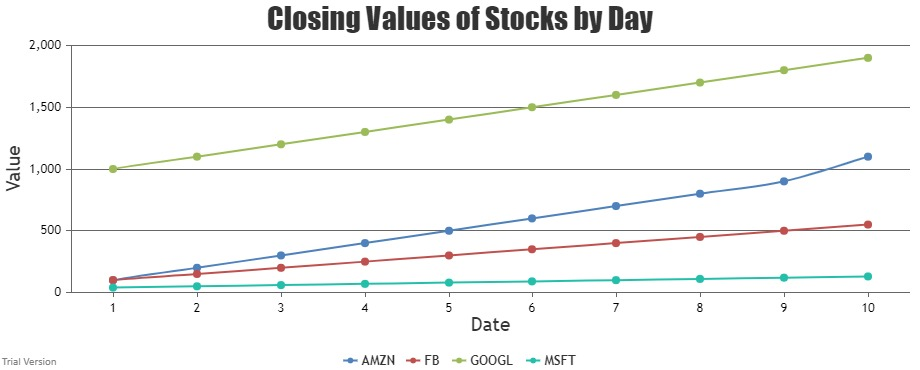

#  CanvasJS

Author: Anthony Faller

Date: 2020-10-03
-----

## Summary
I have created a series of files which creates a remote server, reads from a local file, pipes data to HTML, and displays a graph of said data using CanvasJS.

I struggled a lot with this skill, but Matt Boyd was able to meet with me today to help talk things through. He recommended I use the express module rather than the http module, and we worked through the data pipeline. 

## Sketches and Photos

## Modules, Tools, Source Used Including Attribution
[Express documentation](https://expressjs.com/en/starter/hello-world.html)

[JS Reading from Array](https://stackabuse.com/reading-and-writing-csv-files-with-node-js/)

[JS Array Tutorial](https://www.w3schools.com/js/js_arrays.asp)

[JS For Loops](https://stackoverflow.com/questions/3010840/loop-through-an-array-in-javascript)

[JS Objects](https://www.w3schools.com/js/js_object_properties.asp)

[Example Multi-Series Chart](https://canvasjs.com/javascript-charts/spline-chart-legends/)

## Supporting Artifacts

-----
