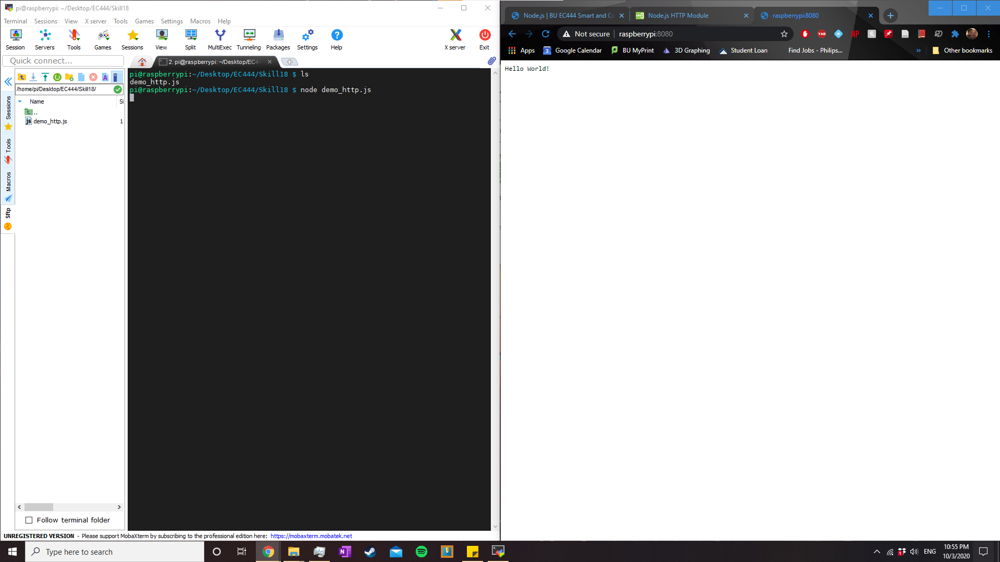

#  Raspberry Pi

Author: Anthony Faller

Date: 2020-10-03
-----

## Summary
I have successfully installed Raspberry Pi OS on the provided Raspberry Pi Zero and connected it to my home wifi network. I'm able to use both the native Windows cmd and MobaXterm to ssh into it, but MobaXterm has built-in file transfer. Using MobaXterm, I was able to load in a basic Hello World js file, run the Node server, and access the HTML page via Google Chrome.

## Sketches and Photos

  

## Modules, Tools, Source Used Including Attribution
[Adafruit Install](https://learn.adafruit.com/raspberry-pi-zero-creation)

## Supporting Artifacts

-----
