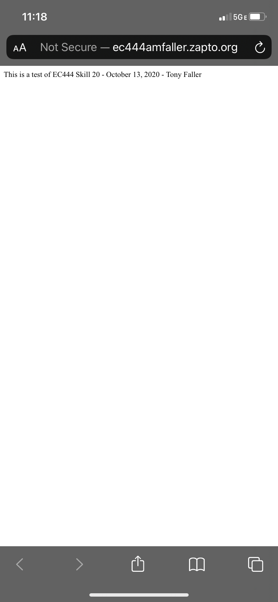

#  DYNDNS for Pi

Author: Anthony Faller

Date: 2020-10-15
-----

## Summary
Since my home network is through Google Nest WiFi, I was able to enable port forwarding but not DDNS on my router. This led me to discussions with Matt and Professor Little about using a DDNS client application on the Pi to allow for DDNS. 

Using No-IP, I was able to remotely connect to a basic Hello World type server running on the Pi. The pictures below demonstrate connections on my phone via local Wifi and my cellular service. My URL for this was http://ec444amfaller.zapto.org:64209

I ran into some issues because my Google router is connected to my ISP's router, meaning I had to set up port forwarding twice. The Router(Port) connection looks like this:

RPi(8080)  <-->  Google Wifi(64209)  <-->  Fios Router(64209)  <-->  Internet

## Sketches and Photos

  

  

## Modules, Tools, Source Used Including Attribution
1. [No-IP RPi Tutorial 1](https://www.noip.com/support/knowledgebase/install-ip-duc-onto-raspberry-pi/)
2. [No-IP RPi Tutorial 2](https://averagemaker.com/2013/09/using-raspberry-pi-as-noip-client.html)
3. [No-IP RPi Tutorial 3](https://www.slicethepi.co.uk/how-to-install-no-ip-on-raspberry-pi/)
4. [No-IP RPi Tutorial 4](https://peppe8o.com/how-to-configure-no-ip-duc-service-in-your-raspberry-pi/)

## Supporting Artifacts
1. [No-IP Port Forwarding](https://www.raspberrypi.org/forums/viewtopic.php?t=134105)
2. [Google Wifi Port Forwarding](https://support.google.com/wifi/answer/6274503?hl=en)
3. [Google Port Forwarding with Second Router](https://support.google.com/googlenest/thread/33704178?hl=en)
4. [Google Wifi Doesn't Have DDNS](https://support.google.com/googlenest/thread/653373?hl=en)
5. [List of Available TCP/UDP Ports](https://en.wikipedia.org/wiki/List_of_TCP_and_UDP_port_numbers)
6. [Tool to Test if Port is Open](https://www.portchecktool.com/)
7. [Private vs Public IPs](https://whatismyipaddress.com/private-ip)

-----
