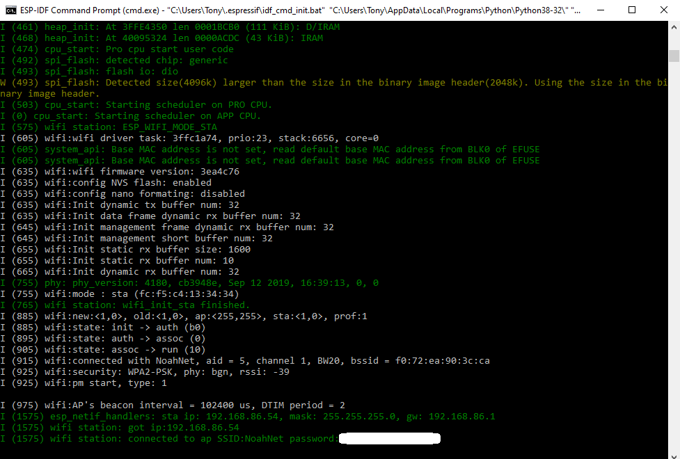
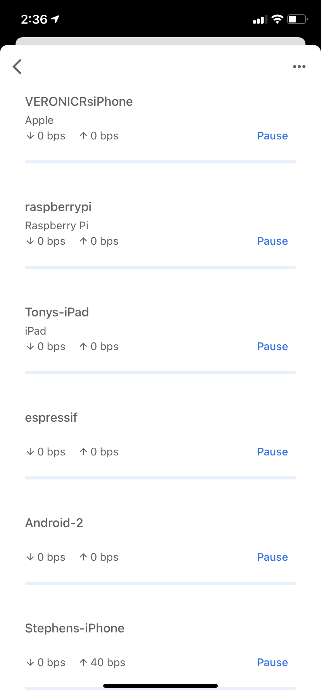

#  WiFi-ESP

Author: Anthony Faller

Date: 2020-10-15
-----

## Summary
I've successfully flashed the provided esp-32 wifi example and connected my board to my home wifi network. For obvious reasons, I've censored my network password in the console screenshot below.

There is also an image showing the esp32 on my home network, via the Google Home app.

## Sketches and Photos

## Modules, Tools, Source Used Including Attribution
[Provided Wifi Example](https://github.com/espressif/esp-idf/tree/master/examples/wifi/getting_started/station)

## Supporting Artifacts

-----
