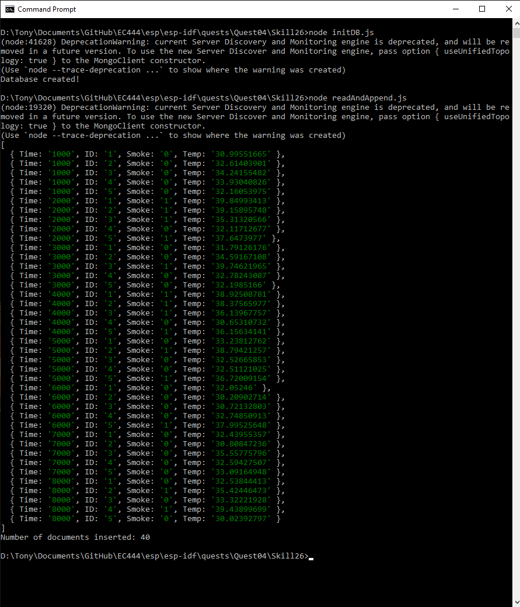
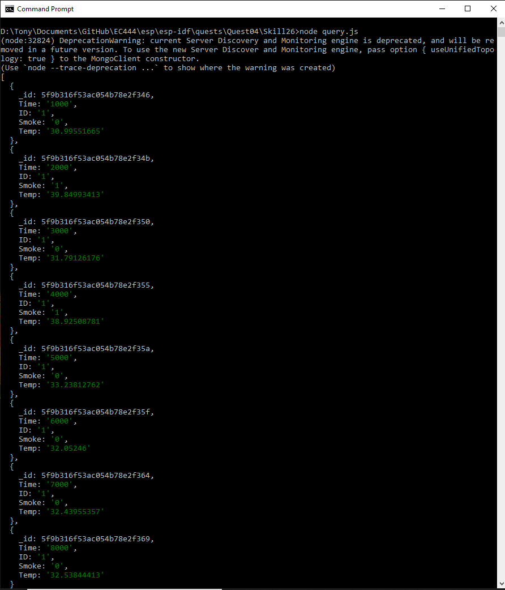

#  Persistence and Databases

Author: Anthony Faller

Date: 2020-10-29
-----

## Summary
I have written code to create a MongoDB database, read a local CSV file, append this CSV file to the database, and query to retrieve information. Requires npm modules `mongodb` and `csv-parser`. 

## Sketches and Photos

## Modules, Tools, Source Used Including Attribution
[MongoDB x NodeJS Tutorial](https://www.w3schools.com/nodejs/nodejs_mongodb.asp) 

## Supporting Artifacts

-----
