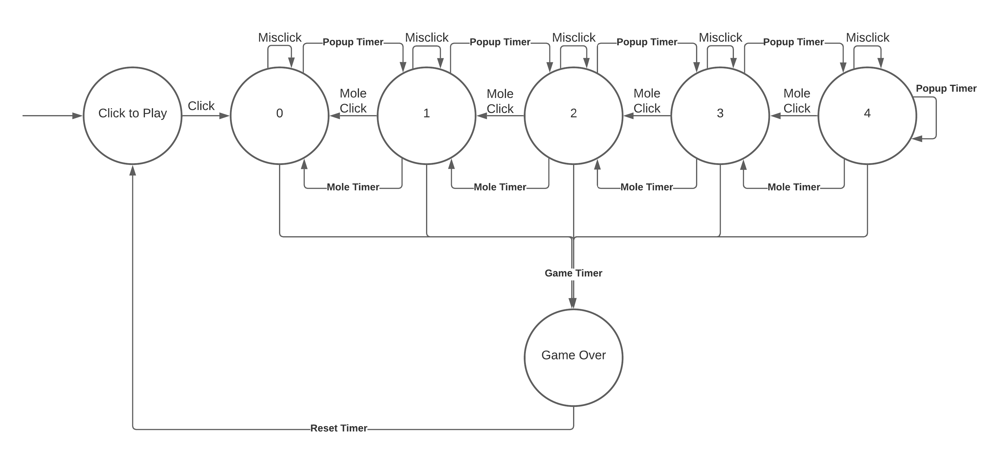
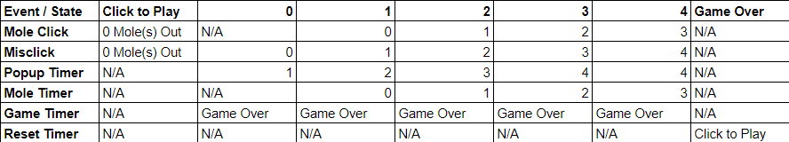

#  State Models

Author: Anthony Faller

Date: 2020-10-30
-----

## Summary
Through observation, I have created a finite state machine representation of the provided Whack-A-Mole game. It would appear that no more than 4 moles are visible at any one time, and regardless of how many moles are visible, the game counter ends the game. The state numbers are equivalent with the number of visible moles.

My code only considers state; it is assumed that all other activies, such as the timers, point increments, and mole location randomization would be handled by other functions. 

## Sketches and Photos

## Modules, Tools, Source Used Including Attribution
[FSM Design Pattern](http://whizzer.bu.edu/briefs/design-patterns/dp-state-machine)

## Supporting Artifacts
[Whack-A-Mole Game](https://www.crazygames.com/game/whack-a-mole)

-----
