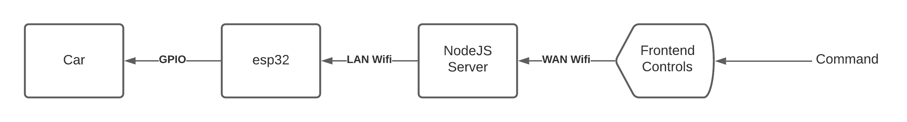

#  Security Issues

Author: Anthony Faller

Date: 2020-11-13
-----

## Summary
Opportunites for malicious activity are available throughout an entire remote communication system. Nearly every node in the datapath is able to be attacked.

Specific Attacks:
1. Absence of authentication: As long as the server is on, anyone can access it. There is no sort of verification to confirm who the client is. 
2. Unreliable data transfer: Since communication is likely done with UDP, data loss is very possible.
3. Cleartext communication: Unencrypted messages means anyone can intercept and read data.
4. No firewall: Since the server has no firewall, it can be easily attacked through other ports.
5. esp32 verification: There is no way for the esp32 to control what code is run. Anyone could access the esp32 and flash/run malicious code.

Attack Mitigation:
1. Add some sort of authentication or login page on the front end.
2. Switch communication to use TCP for reliable data transfer.
3. Add encryption to secure communications.
4. Configure a firewall and close all other ports.
5. Enable Secure Boot in the esp32.

## Sketches and Photos

  

## Modules, Tools, Source Used Including Attribution

## Supporting Artifacts

-----
