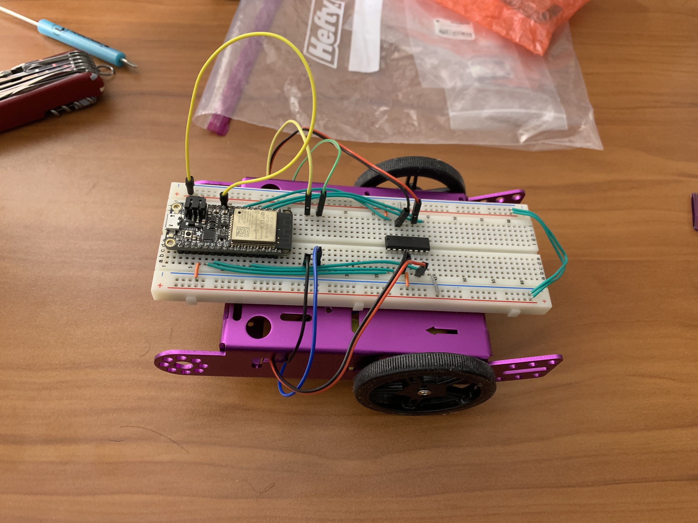
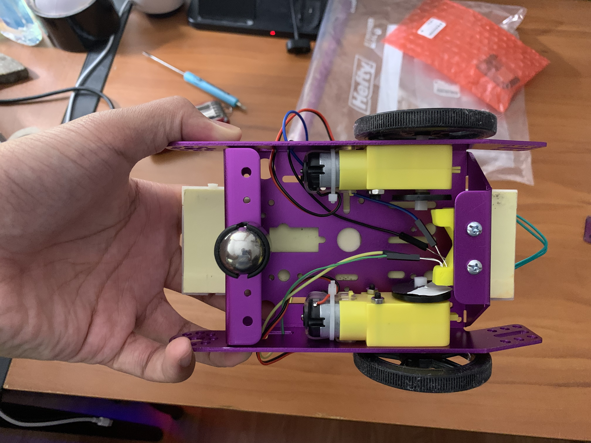

#  Purple Car and TT Motors

Author: Anthony Faller

Date: 2020-11-18
-----

## Summary
Using the provided example code and diagrams, I have assembled my purple car and written code to test various driving functions. This was accomplished by using PWM on the enable ports of the H-bridge IC, as well as using GPIO to control the inputs of the H-bridge itself. Through trial and error, the correct configurations for driving forwards and backwards, turning left and right, and stopping were discovered. 

## Sketches and Photos

 

  

## Modules, Tools, Source Used Including Attribution
1. [Picture of Wired Car](http://whizzer.bu.edu/skills/assemble-car)
2. [Diagrams of H-bridge Wiring](http://whizzer.bu.edu/skills/motor)
3. [espressif Brushed Motor Example Code](https://github.com/espressif/esp-idf/tree/11b444b8f493165eb4d93f44111669ee46be0327/examples/peripherals/mcpwm/mcpwm_brushed_dc_control)
4. [L293 Data Sheet](https://cdn-shop.adafruit.com/datasheets/l293d.pdf)
5. [H-bridge Tutorial](http://www.modularcircuits.com/blog/articles/h-bridge-secrets/h-bridges-the-basics/)
6. [espressif PWM Documentation](https://docs.espressif.com/projects/esp-idf/en/latest/esp32/api-reference/peripherals/mcpwm.html#_CPPv417mcpwm_duty_type_t)

## Supporting Artifacts
[Demo Video](https://drive.google.com/file/d/1fWMOeeFW1HkSZEdefXOeTN1XMVAca5I6/view?usp=sharing)

-----
