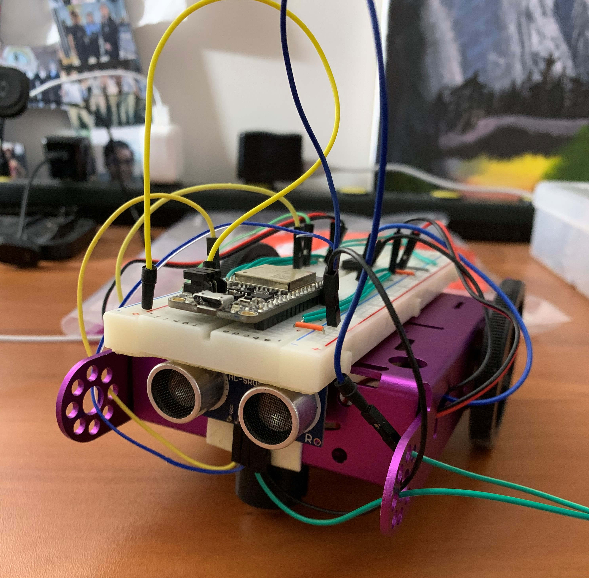

#  Garmin LIDAR V4 (Alternative Sensor)

Author: Anthony Faller

Date: 2020-11-19
-----

## Summary
Through the modification of a few different example code files, I have created code which polls the HC-SR04 ultrasonic sensor for a distance in centimeters. Testing with a ruler and a measuring tape revealed that the sensor is accurate to about 3 cm.

Huge thank you to Shaivya for collaborating with me on this skill. We searched for example code, read documentation, and debugged together tonight.

## Sketches and Photos

 

## Modules, Tools, Source Used Including Attribution
[Ultrasonic Datasheet](https://cdn.sparkfun.com/assets/b/3/0/b/a/DGCH-RED_datasheet.pdf)

[RMT Driver Documentation](https://docs.espressif.com/projects/esp-idf/en/latest/esp32/api-reference/peripherals/rmt.html)

[espressif RMT Examples](https://github.com/espressif/esp-idf/tree/178b122c145c19e94ac896197a3a4a9d379cd618/examples/peripherals/rmt)

[hcsr04 specific example](https://github.com/petemadsen/esp32/blob/master/hc-sr04/main/hcsr04.c)

## Supporting Artifacts
[Demo Video](https://drive.google.com/file/d/1zZxAlT-NQHM5FEj1UhaNJhhwTei0k2rX/view?usp=sharing)

-----
