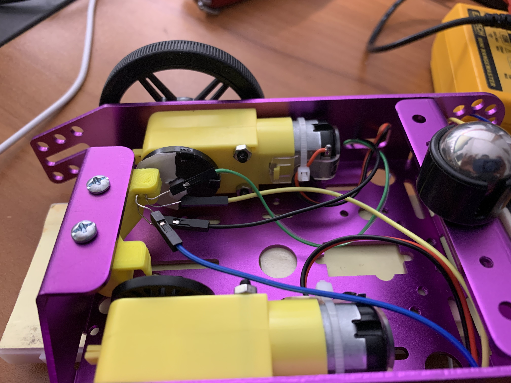

#  Wheel and Car Speed Sensor

Author: Anthony Faller

Date: 2020-11-21
-----

## Summary
Through the use of ADC and state machines, I have written code which calculates the velocity of the car. Using a half-black half-white circle and an optical encoder, the number of revolutions per second are counted. Then, the number of revolutions per second is calculated to meters per second. Forward is used as the positive reference frame. 

It was noticed during testing that the velocity reading logs a ramp up and ramp down, consistent with expectations that motors do not rotate instantaneously.

## Sketches and Photos

 

## Modules, Tools, Source Used Including Attribution
[Example Code](https://learn.sparkfun.com/tutorials/qrd1114-optical-detector-hookup-guide#example-circuit)

## Supporting Artifacts
[Encoder Datasheet](https://www.sparkfun.com/datasheets/BOT/QRD1114.pdf)

[Wiring Guide](https://www.robotshop.com/community/forum/t/hooking-up-qrd1114-line-sensor/12952)

[Demo Video](https://drive.google.com/file/d/1q26UQl7snhOpIJuTiEDei0wU4nMC4TTZ/view?usp=sharing)

-----
